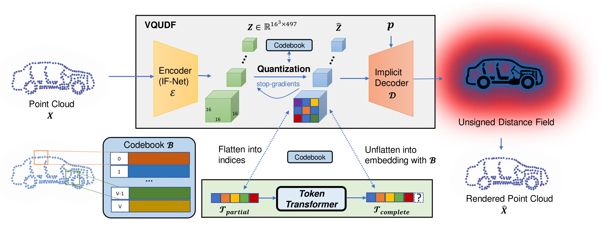

# FullFormer
This is official repository of FullFormer: Generating Shapes Inside Shapes paper. This work is accepted to DAGM/GCPR2023.
## The Methodology of this paper is as follows:


## Install:
The project requires a Linux system that is equipped with Cuda 10.

All subsequent commands assume that you have cloned the repository in your terminal and navigated to its location.

A file named "env.yml" contains all necessary python dependencies.

To conveniently install them automatically with [anaconda](https://www.anaconda.com/) you can use:

```
conda env create -f env.yml

conda activate VQDIG
```


